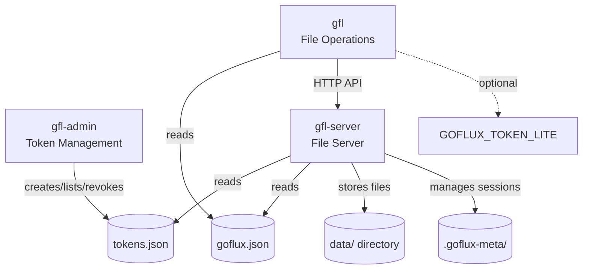
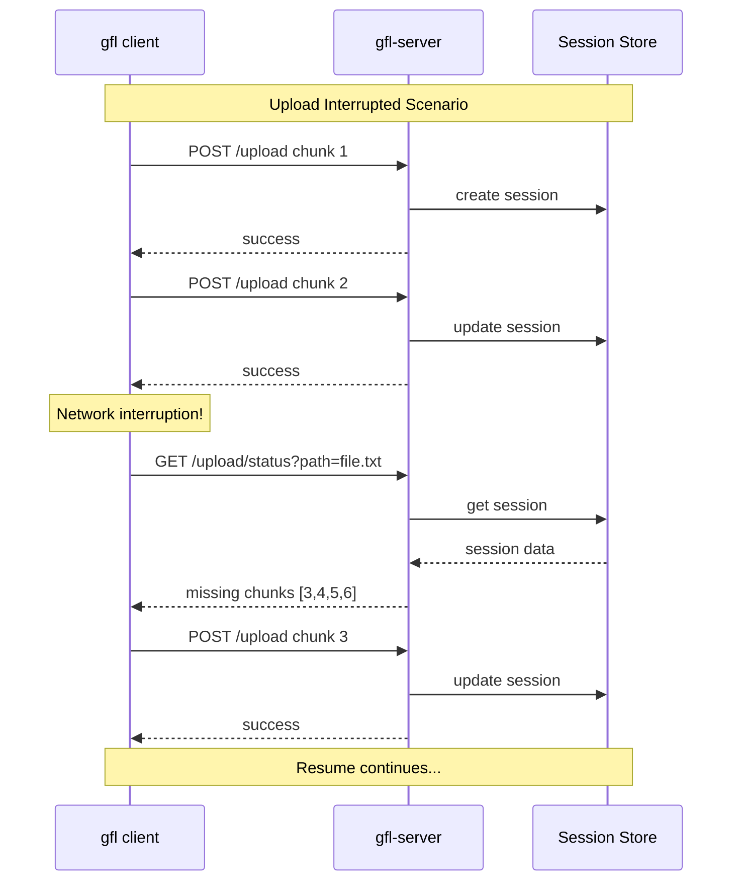
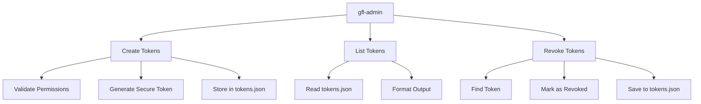
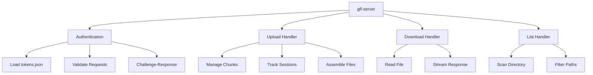
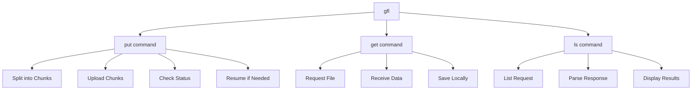
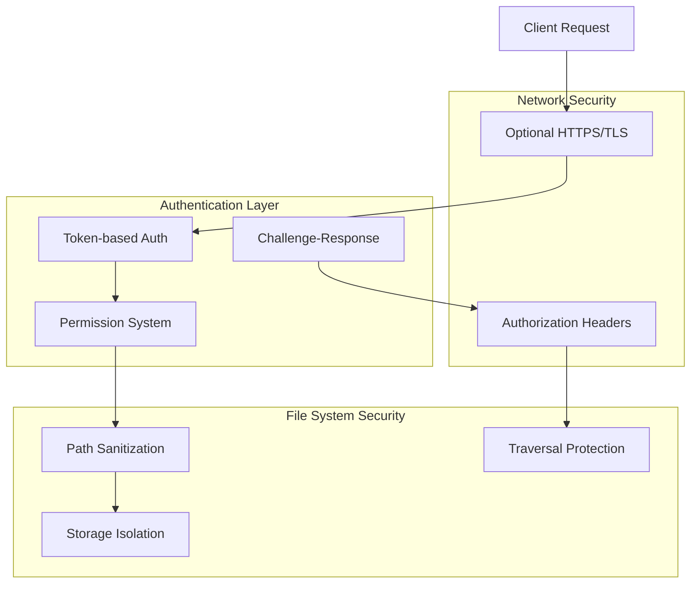

# GoFlux Lite Architecture

This document provides an overview of how the three GoFlux Lite components interact with each other.

## Component Interaction Diagram



## Authentication Flow

```mermaid
sequenceDiagram
    participant A as gfl-admin
    participant TF as tokens.json
    participant S as gfl-server
    participant C as gfl
    
    Note over A,C: 1. Setup Phase
    A->>TF: create token
    TF-->>A: token created
    
    Note over A,C: 2. Server Startup
    S->>TF: read tokens
    TF-->>S: token data loaded
    S->>S: enable authentication
    
    Note over A,C: 3. Client Operations
    C->>C: read GOFLUX_TOKEN_LITE or config
    C->>S: API request + token
    S->>S: validate token
    S-->>C: authenticated response
## File Upload Flow

```mermaid
sequenceDiagram
    participant C as gfl client
    participant S as gfl-server
    participant FS as File System
    participant SS as Session Store
    
    Note over C,SS: Chunked Upload Process
    
    C->>S: POST /upload chunk 1
    S->>SS: create/update session
    SS-->>S: session updated
    S->>FS: store chunk
    FS-->>S: chunk stored
    S-->>C: chunk accepted
    
    C->>S: POST /upload chunk 2
    S->>SS: update session
    SS-->>S: session updated
    S->>FS: store chunk
    FS-->>S: chunk stored
    S-->>C: chunk accepted
    
    Note over C,SS: more chunks...
    
    C->>S: POST /upload final chunk
    S->>SS: complete session
    SS-->>S: session completed
    S->>FS: assemble final file
    FS-->>S: file complete
    S->>SS: cleanup session
    SS-->>S: session deleted
    S-->>C: upload complete
```

## Resume Workflow



## Component Responsibilities

### gfl-admin Token Management



### gfl-server File Server



### gfl Client



## Security Architecture



## Data Flow Summary

1. **Setup**: Admin creates tokens using `gfl-admin`
2. **Server Start**: Server loads tokens and starts listening
3. **Client Auth**: Client uses token (env var or config) for authentication
4. **File Operations**: Client performs authenticated file operations
5. **Resume Support**: Interrupted uploads automatically resume
6. **Session Persistence**: Upload state survives server restarts

## Key Design Principles

- **Separation of Concerns**: Each tool has a single responsibility
- **Stateless Operations**: Server is stateless except for upload sessions
- **Security by Default**: Authentication required, path traversal protection
- **Resume Capability**: Robust handling of network interruptions
- **Simple Configuration**: Minimal setup required
- **Cross-Platform**: Works consistently across operating systems